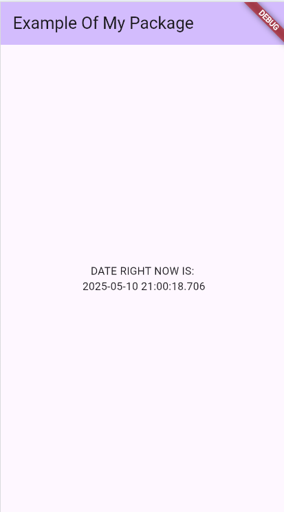

# date_formatter_package

A simple and customizable Dart package to format `DateTime` objects in human-readable formats. This is ideal for Flutter or Dart apps that need clear and friendly date display options.

---

## Features

- Format date as `DD/MM/YYYY` (e.g., `10/05/2025`)
- Lightweight, dependency-free, and easy to use

---

## 📄 Example Output

